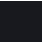
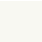

<!-- PROJECT LOGO -->
 

  

  <h3 align="center">Vampyric Dark</h3>

  

     A dark theme for all platforms.
     
    <a href="https://github.com/VampyricDark/"><strong>Explore the available themes»</strong></a>
     
     
    <a href="https://github.com/VampyricDark/VampyricDark/issues">Report Bug</a>
    ·
    <a href="https://github.com/VampyricDark/VampyricDark/issues">Request Feature</a>
  

<!-- TABLE OF CONTENTS -->

  
Table of Contents

  <ol>
    <li>
      <a href="#about-the-project">About The Project</a>
      <ul>
      </ul>
    </li>
    <li><a href="#license">License</a></li>
    <li><a href="#acknowledgements">Acknowledgements</a></li>
  </ol>

<!-- ABOUT THE PROJECT -->
### About the project
Vampyric Dark is a theme inspired from Dracula Dark Theme. It's a project that came to be due to my own dissatisfactions with how the theme is and wanting it
to be darker and have a proper accent color instead of having everyone using different accent colors in their own implementations.

<!-- GETTING STARTED -->
## Color Palette
The colors used in this theme are as follows:

Palette      | Hex       | RGB   | HSL | 
---          | ---       | ---   | --- | ---
Accent       | `#383a59` | ``    | ``  | 
Background   | `#18191f` | ``    | ``  | 
Black        | `#3b3c4a` | ``    | ``  | 
Red          | `#e04848` | ``    | ``  | 
Green        | `#59de47` | ``    | ``  | 
Yellow       | `#e3db4b` | ``    | ``  | 
Blue         | `#4e72e6` | ``    | ``  | 
Purple       | `#6550eb` | ``    | ``  | 
Magenta      | `#ff59c5` | ``    | ``  | 
Cyan         | `#54a7f0` | ``    | ``  | 
White        | `#f8f8f2` | ``    | ``  | 
Grey         | `#949494` | ``    | ``  | 
  

There will also be a spec sheet so that you can have a better idea on how to implement this theme on your end for more consistency across themes.

## License

Distributed under MIT License. See `LICENSE` for more information.

<!-- ACKNOWLEDGEMENTS -->
## Acknowledgements
This project was created by [RaphGL](https://github.com/RaphGL/) with the help of the awesome people that have contributed with themes.
Special thanks to:
- [TODO]()

<!-- MARKDOWN LINKS & IMAGES -->
<!-- https://www.markdownguide.org/basic-syntax/#reference-style-links -->
[contributors-shield]: https://img.shields.io/github/contributors/othneildrew/Best-README-Template.svg?style=for-the-badge
[contributors-url]: https://github.com/othneildrew/Best-README-Template/graphs/contributors
[forks-shield]: https://img.shields.io/github/forks/othneildrew/Best-README-Template.svg?style=for-the-badge
[forks-url]: https://github.com/othneildrew/Best-README-Template/network/members
[stars-shield]: https://img.shields.io/github/stars/othneildrew/Best-README-Template.svg?style=for-the-badge
[stars-url]: https://github.com/othneildrew/Best-README-Template/stargazers
[issues-shield]: https://img.shields.io/github/issues/othneildrew/Best-README-Template.svg?style=for-the-badge
[issues-url]: https://github.com/othneildrew/Best-README-Template/issues
[license-shield]: https://img.shields.io/github/license/othneildrew/Best-README-Template.svg?style=for-the-badge
[license-url]: https://github.com/othneildrew/Best-README-Template/blob/master/LICENSE.txt
[linkedin-shield]: https://img.shields.io/badge/-LinkedIn-black.svg?style=for-the-badge&logo=linkedin&colorB=555
[linkedin-url]: https://linkedin.com/in/othneildrew
[product-screenshot]: images/screenshot.png
